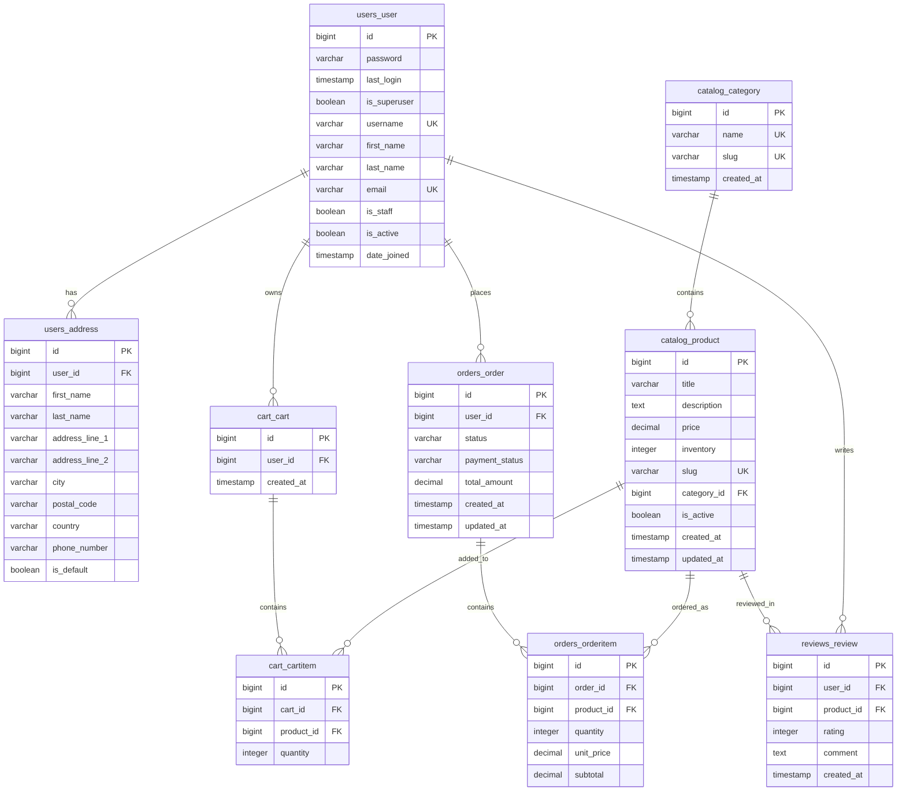

# Database Entity Relationship Diagram

## Database Schema Summary

### Core Entities

#### 1. User Management
- **users_user**: Extended Django user model with email-based authentication
- **users_address**: Multiple shipping addresses per user with default selection

#### 2. Product Catalog
- **catalog_category**: Hierarchical product categorization
- **catalog_product**: Product information with pricing, inventory, and metadata

#### 3. Shopping Experience
- **cart_cart**: User shopping carts (can be anonymous)
- **cart_cartitem**: Items in shopping carts with quantities

#### 4. Order Management
- **orders_order**: Order headers with status tracking
- **orders_orderitem**: Individual line items within orders

#### 5. Customer Feedback
- **reviews_review**: Product reviews with 1-5 star ratings

### Key Relationships

1. **One-to-Many**:
   - User → Addresses (1:M)
   - User → Carts (1:M)
   - User → Orders (1:M)
   - User → Reviews (1:M)
   - Category → Products (1:M)
   - Cart → CartItems (1:M)
   - Order → OrderItems (1:M)

2. **Many-to-Many** (through intermediary tables):
   - User ↔ Products (through Cart/Order/Review)
   - Cart ↔ Products (through CartItems)
   - Order ↔ Products (through OrderItems)

3. **Unique Constraints**:
   - User can only review a product once (user_id, product_id unique)
   - Email addresses must be unique
   - Product and category slugs must be unique

### Business Rules Enforced

1. **User Management**:
   - Email-based authentication
   - Multiple shipping addresses per user
   - Default address selection

2. **Product Catalog**:
   - Products must belong to a category
   - Inventory tracking with non-negative constraints
   - URL-friendly slugs for SEO

3. **Shopping Cart**:
   - Items have positive quantities
   - Anonymous carts supported (user_id can be null)

4. **Orders**:
   - Order status workflow (pending → completed/failed)
   - Payment status tracking
   - Historical pricing preservation in order items

5. **Reviews**:
   - Rating scale 1-5 stars
   - One review per user per product
   - Optional comment field

### Performance Optimizations

#### Indexes Created:
- `catalog_product(price)` - for price-based filtering
- `catalog_product(created_at)` - for chronological sorting
- `catalog_product(category_id)` - for category browsing
- `orders_order(user_id)` - for user order history
- `orders_order(status)` - for order management
- `reviews_review(product_id)` - for product reviews
- `users_address(user_id)` - for user addresses

#### Views for Reporting:
- `order_summary` - Order overview with customer details
- `product_stats` - Product performance metrics

### Data Integrity

#### Foreign Key Constraints:
- Addresses → Users (CASCADE DELETE)
- Products → Categories (CASCADE DELETE)
- CartItems → Carts (CASCADE DELETE)
- CartItems → Products (CASCADE DELETE)
- OrderItems → Orders (CASCADE DELETE)
- OrderItems → Products (RESTRICT DELETE)
- Reviews → Users (CASCADE DELETE)
- Reviews → Products (CASCADE DELETE)

#### Check Constraints:
- Product inventory ≥ 0
- CartItem quantity > 0
- OrderItem quantity > 0
- Review rating between 1 and 5
- Order status in allowed values
- Payment status in allowed values

This schema supports a full-featured e-commerce application with user management, product catalog, shopping cart, order processing, and customer review functionality.
